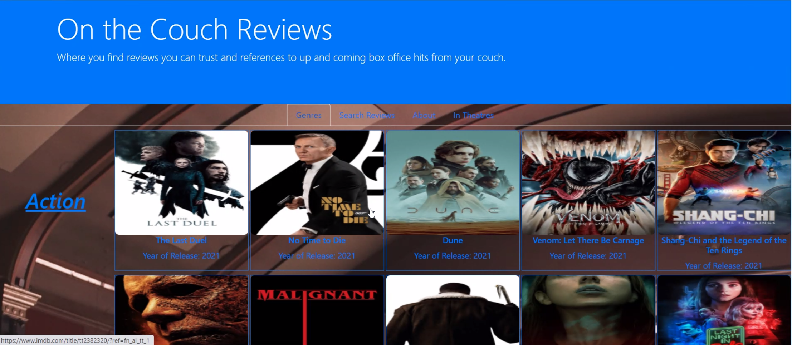
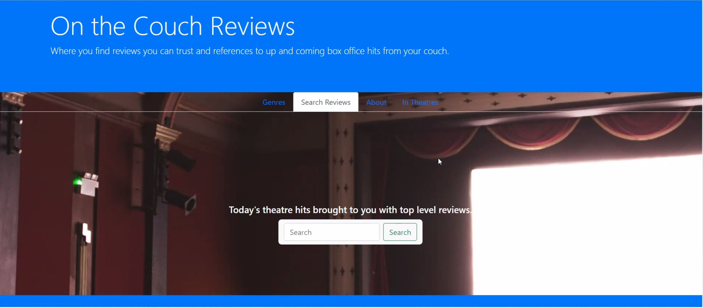
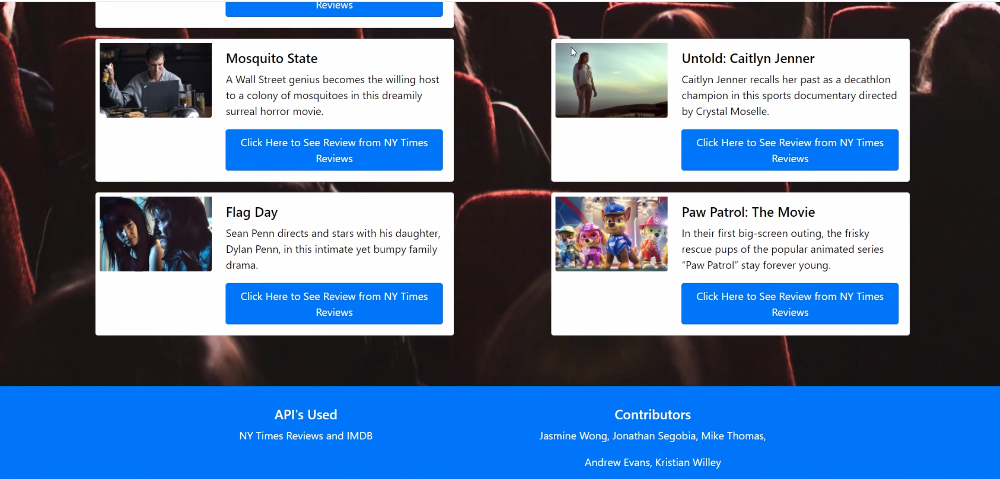
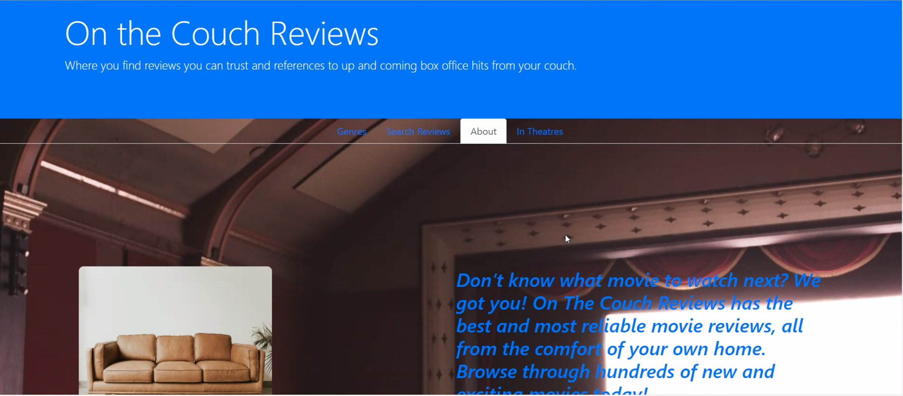
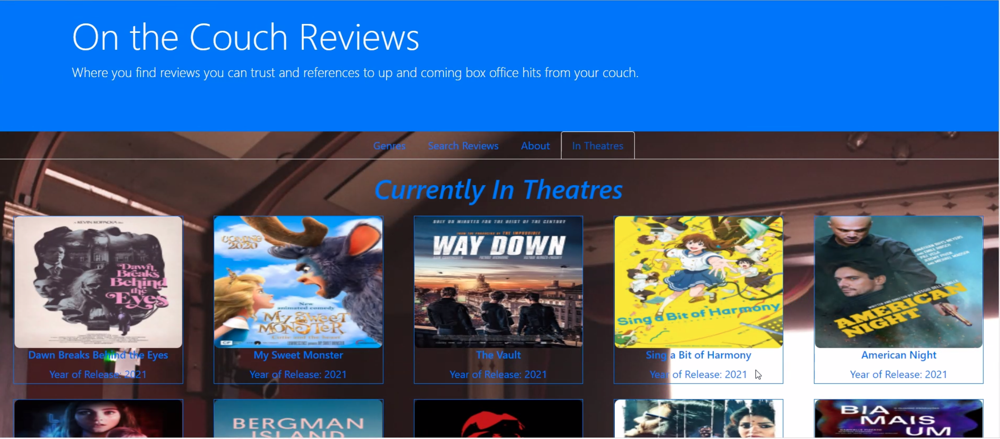

# On The Couch Reviews

```
Our goal was to create a website using React, Bootstrap, and APIs.

This website will allow people from all over the world to be able to see reviews of many

genres from the comfort of their couch.
```

# User Story
```
AS A movie watcher

I WANT to see reviews of the best movies

SO THAT I can watch them and talk about it with my friends and family
```
# Screenshots











# Resources
```
Github - https://github.com/Drewbo51/OnTheCouch

IMDB API - 'https://movies-tvshows-data-imdb.p.rapidapi.com/'

IMDB - https://www.imdb.com/

NY Times Reviews API - https://api.nytimes.com

NY Times - https://www.nytimes.com/
```